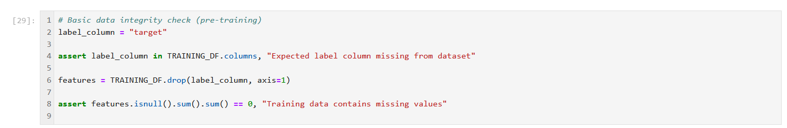
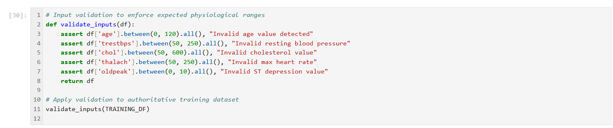
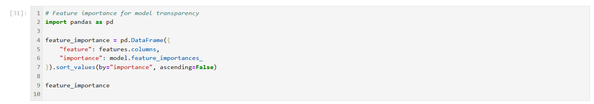
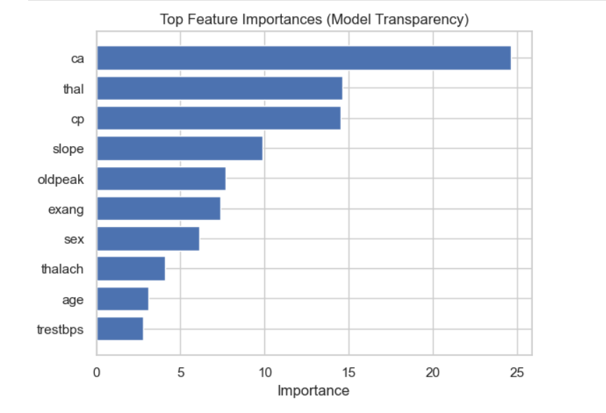

# 🫀 Heart Disease Prediction -- Security-Hardened Machine Learning (OWASP AI Top 10)

## Overview

This project explores heart disease prediction using structured clinical data while demonstrating how **machine learning systems can be designed with security, governance, and trust in mind**.

In addition to comparing traditional machine learning models (**Logistic Regression**, **K-Nearest Neighbors**, **Random Forest**) against **CatBoost**, a modern gradient boosting algorithm optimized for tabular data, the project explicitly integrates **OWASP AI Top 10 security controls** directly into the ML workflow.

The result is not just a performant model, but a **production-aware, security-hardened AI system** suitable for high-impact domains such as healthcare.

---

## Objectives

* Build a robust heart disease prediction pipeline using structured clinical data
* Compare traditional ML models vs. CatBoost using cross-validated metrics
* Evaluate trade-offs between **accuracy**, **interpretability**, and **model complexity**
* Integrate **AI security controls** aligned with the OWASP AI Top 10
* Demonstrate responsible, decision-support-focused AI design in a healthcare context

---

## Dataset

The project uses the **UCI Cleveland Heart Disease dataset**, a widely studied benchmark in medical ML research:

🔗 [https://archive.ics.uci.edu/ml/datasets/heart+Disease](https://archive.ics.uci.edu/ml/datasets/heart+Disease)

The dataset is static, well-documented, and contains **no personally identifiable information (PII)**.

---

## 🔐 AI Security (OWASP AI Top 10)

This project incorporates **security-aware design principles aligned with the OWASP AI Top 10**, demonstrating how AI risks can be mitigated **within the ML pipeline itself**, rather than treated as an afterthought.

Security controls are intentionally applied to the **authoritative training dataset** to prevent integrity checks from being bypassed by derived evaluation or reporting artifacts.

### Implemented Controls

* **A01 – Model Manipulation / Data Poisoning**

  * Training data integrity validation
  * Explicit schema enforcement
  * Isolation of authoritative training data from derived artifacts

* **A03 – Input Validation**

  * Enforcement of physiological bounds for key clinical features
  * Rejection of malformed or out-of-range inputs prior to inference

* **A04 – Automation Bias**

  * Explicit decision-support framing
  * Clear disclaimers to prevent misuse as a clinical diagnostic tool
  * Emphasis on human judgment and medical oversight

* **A05 – Transparency**

  * Feature importance analysis for interpretability
  * Visibility into which features most influence predictions
  * Audit-friendly inspection of model behavior

---

## 🔐 Securing the Machine Learning Model (Code-Level Controls)

This section highlights **practical, code-level security controls** implemented directly in the notebook and mapped to the OWASP AI Top 10.

### 🔴 A01 – Model Manipulation (Training Data Poisoning)

**Threat:**
Malicious or corrupted training data could bias predictions and lead to unsafe outcomes.

**Controls Implemented:**

* Freeze the authoritative training dataset
* Enforce expected schema
* Validate data integrity prior to training

```python
# Freeze authoritative training dataset for security checks
TRAINING_DF = df.copy()

label_column = "target"
assert label_column in TRAINING_DF.columns, "Expected label column missing from dataset"

features = TRAINING_DF.drop(label_column, axis=1)
assert features.isnull().sum().sum() == 0, "Training data contains missing values"
```

**Evidence:**


---

### 🔴 A03 – Input Validation & Adversarial Input Handling

**Threat:**
Out-of-range or malformed inputs may result in unreliable or unsafe predictions, especially in healthcare contexts.

**Controls Implemented:**

* Enforce domain-aware physiological bounds
* Reject unsafe inputs before inference

```python
def validate_inputs(df):
    assert df['age'].between(0, 120).all()
    assert df['trestbps'].between(50, 250).all()
    assert df['chol'].between(50, 600).all()
    assert df['thalach'].between(50, 250).all()
    assert df['oldpeak'].between(0, 10).all()
    return df

validate_inputs(TRAINING_DF)
```

**Evidence:**


---

### 🔴 A05 – Model Transparency & Explainability

**Threat:**  
Opaque model behavior reduces trust, auditability, and the ability to validate predictions
in high-impact domains such as healthcare.

**Controls Implemented:**
- Feature importance analysis
- Human-readable transparency into model behavior

```python
feature_importance = pd.DataFrame({
    "feature": features.columns,
    "importance": model.feature_importances_
}).sort_values(by="importance", ascending=False)

feature_importance

```
## Key Visualizations

### 📊 Model Evaluation & Comparison
- Traditional ML vs CatBoost cross-validation metrics
- Confusion matrices and tuned model evaluation

### 🔍 A05 – Model Transparency & Metrics
Feature importance and supporting metrics used to validate model behavior
and improve auditability.






---

### 🟡 A04 – Automation Bias (Governance Control)

Automation bias is mitigated through **system framing and governance**, not artificial code enforcement.

Controls include:

* Decision-support-only positioning
* Explicit medical disclaimers
* No automated clinical decision pathways

This aligns with OWASP guidance that A04 is primarily a **human-factors risk**.

---

## 🧠 Threat Model (High-Level)

### Assets

* Training dataset
* Trained ML models
* Prediction outputs
* Evaluation metrics and visualizations

### Threats & Mitigations

| Threat                       | OWASP AI Category | Mitigation                                   |
| ---------------------------- | ----------------- | -------------------------------------------- |
| Training data poisoning      | A01               | Dataset integrity checks, static data source |
| Out-of-range inputs          | A03               | Input validation and range enforcement       |
| Over-reliance on predictions | A04               | Decision-support framing and disclaimers     |
| Opaque model behavior        | A05               | Feature importance analysis                  |

This threat model demonstrates how **AI risks are addressed at the system design level**, not just at the model level.

---

## Tools & Libraries

* **Python**, Jupyter Notebook
* **Pandas**, **NumPy**, **Matplotlib**, **Seaborn**
* **Scikit-learn**
* **CatBoost**

---

## Key Visualizations

(Existing evaluation and transparency figures retained)

---

## Repository Structure

```
├── Heart-Disease-Prediction.ipynb   # ML pipeline + AI security controls
├── images/                          # Evaluation, transparency, and security evidence
├── README.md                        # Project overview, AI security, threat model
```

---

## How to Run

1. Clone the repository
2. Create and activate a virtual environment
3. Install required dependencies
4. Run `Heart-Disease-Prediction.ipynb` using Jupyter Notebook

---

## Why This Project Matters

Machine learning accuracy alone is insufficient in healthcare.
This project demonstrates how AI systems can be designed to:

* Reduce misuse and over-reliance
* Improve transparency and trust
* Embed security and governance from the start

---

## License

This project is intended for **educational and research purposes only** and is **not a medical device**.

---


