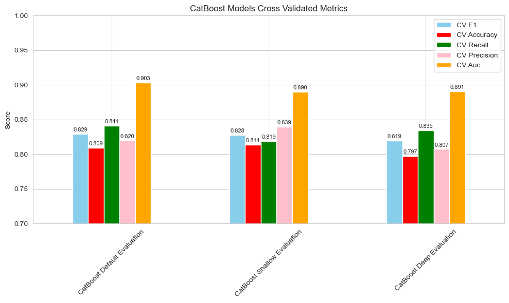
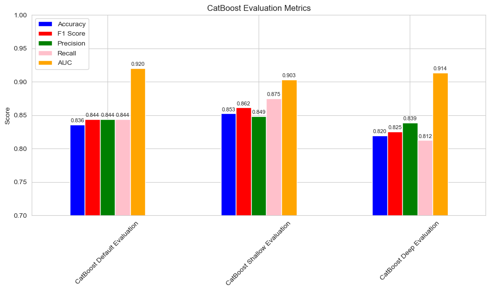
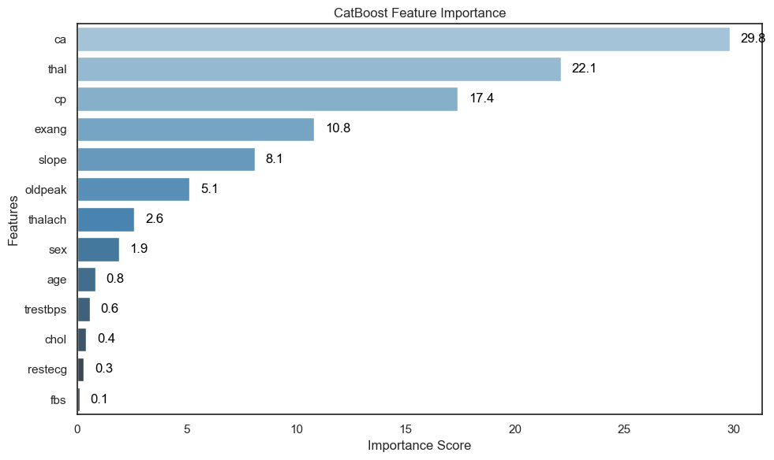
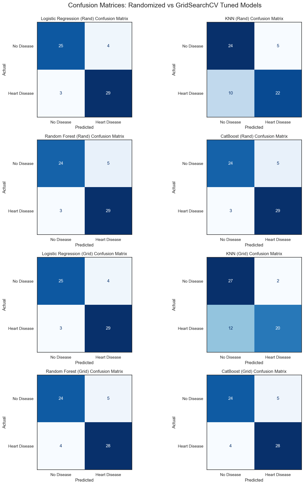
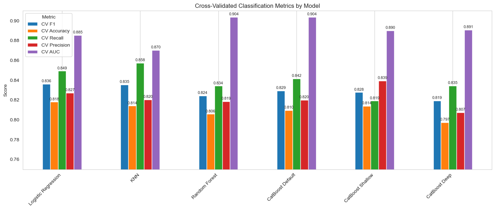
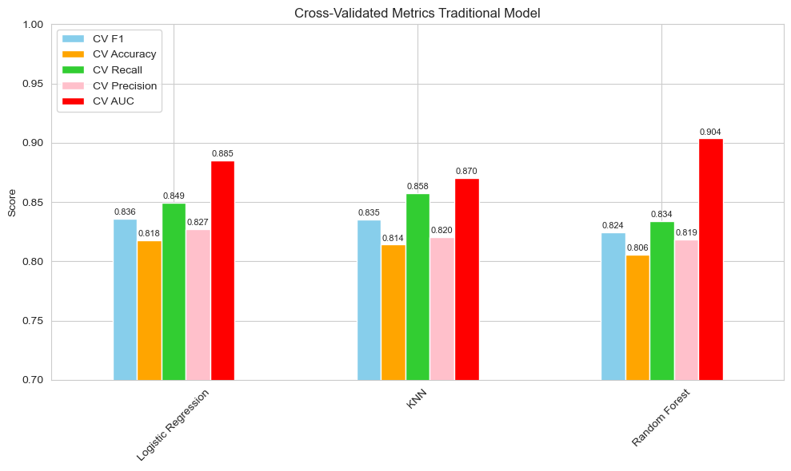
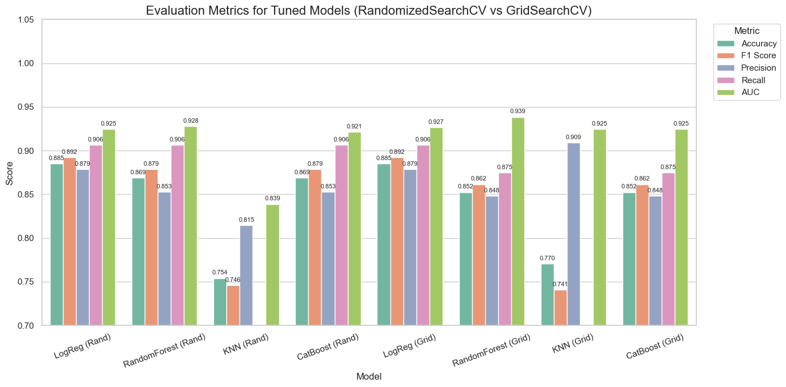
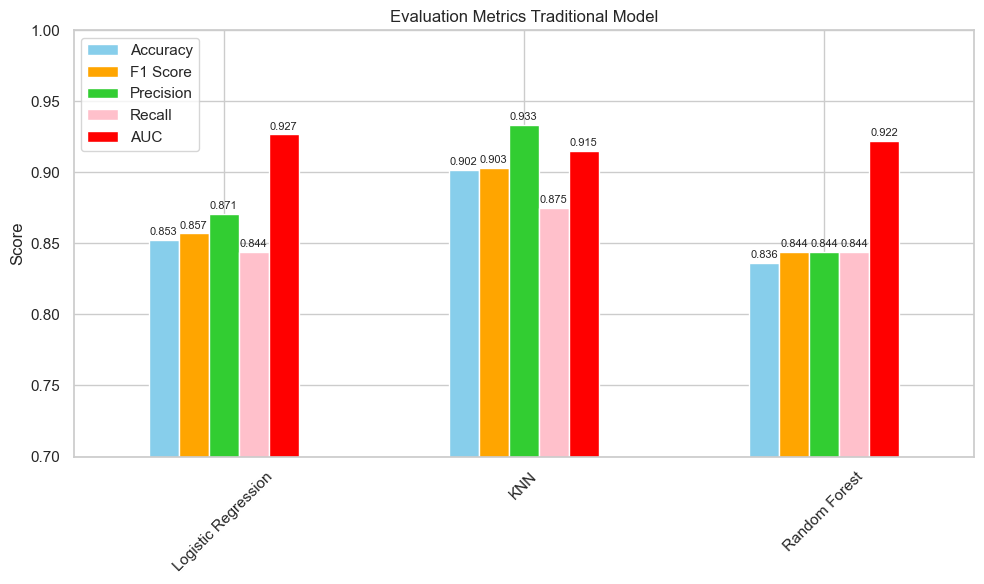

## 🫀 Heart Disease Prediction with Traditional ML vs. CatBoost
## Overview
This project investigates the performance of different machine learning models in predicting heart disease using structured clinical data. We compare traditional algorithms **Logistic Regression**, **K-Nearest Neighbors (KNN)**, and **Random Forest** against **CatBoost**, a modern gradient boosting method designed for high accuracy on tabular data and native handling of categorical features.
## Objectives
- Build a robust heart disease prediction pipeline.
- Evaluate model performance using cross-validation.
- Compare traditional ML models vs. CatBoost on metrics like **Accuracy**, **F1 Score**, **Precision**, **Recall**, and **AUC**.
- Assess the trade-offs between model **simplicity**, **interpretability**, and **predictive power**.
## Dataset
We use the [UCI Cleveland Heart Disease dataset](https://archive.ics.uci.edu/ml/datasets/heart+Disease), a widely studied dataset in medical ML research.
## Tools & Libraries
- Python, Jupyter Notebook
- Pandas, NumPy, Matplotlib, Seaborn
- Scikit-learn
- CatBoost
## Key Visualizations
### 📊 Catboost cv metrics

### 📊 Catboost evaluation

### 📊 Catboost feature importance

### 📊 Confusion matrix random vs grid

### 📊 Cross validated metrics by model

### 📊 Traditional cv metrics

### 📊 Evaluation tuned models

### 📊 Traditional evaluation

## Repository Structure
```
├── Heart-Disease-Prediction.ipynb   # Main notebook
├── images/                          # Evaluation visualizations
│   ├── catboost_cv_metrics.png
│   ├── catboost_evaluation.png
│   ├── catboost_feature_importance.png
│   ├── confusion_matrix_random_vs_grid.png
│   ├── cross_validated_metrics_by_model.png
│   ├── traditional_cv_metrics.png
│   ├── evaluation_tuned_models.png
│   ├── traditional_evaluation.png
├── README.md                        # Project description and setup
```
## How to Run
1. Clone the repository
2. Set up a virtual environment and install dependencies
3. Run `Heart-Disease-Prediction.ipynb` using Jupyter Notebook
## License
This project is for educational and research purposes.
